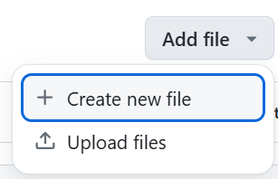
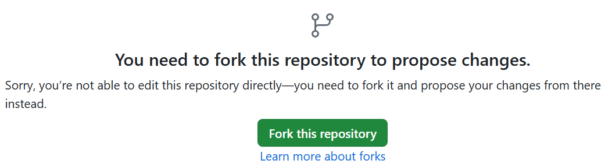
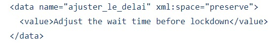
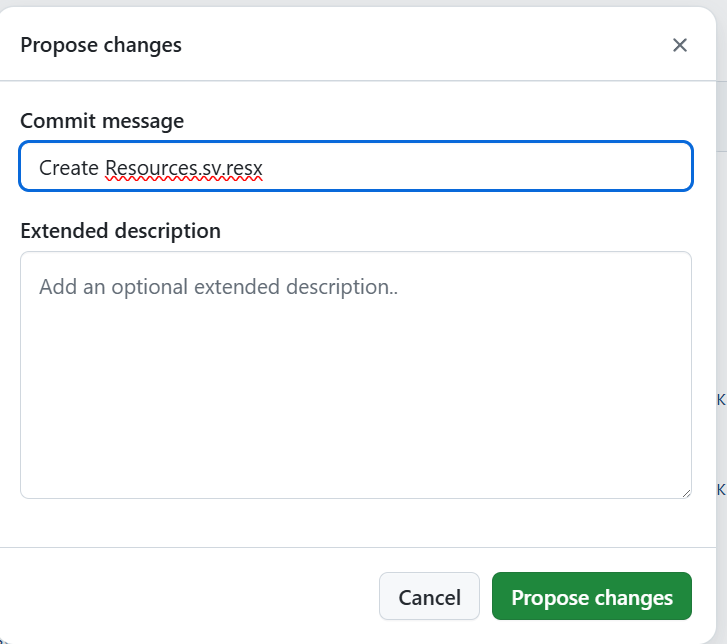
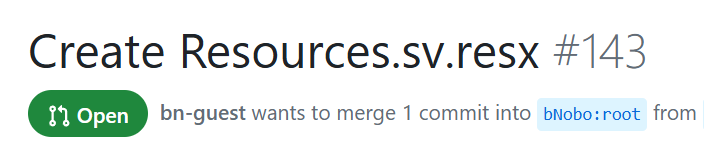

# Contributing

If you want to contribute, please participate in discussions on GitHub issues or create a fork and submit me a pull request.

## Translations

### How to add a new language translations ?

NEED A BREAK! is currently translated to french and italian. It fallbacks to english when the user language is not supported.

If you would like to have NEED A BREAK! in your own language, feel free to submit a pull request.

1. Go to [NeedABreak/Properties folder](./NeedABreak/Properties)
1. Clic on Add file > Create new file

1. Create a fork so you can submit the new file

1. Name the file `Resources.<lang_code>.resx` where `lang_code` is the [ISO 639-1 language code](https://en.wikipedia.org/wiki/List_of_ISO_639_language_codes) de votre langue. For example `Resources.sv.resx`.
1. Copy the content of the default `Resources.resx` file into your file
1. Translate each sentences between `<value>` and `</value>` tags.

1. Clic on "Commit changes..." when you're done

1. Review you're translations and create a pull request when you're ready to submit them

1. Once submitted, the pull request will appear with the "Open" status


### Translations in the code

When working on the UI, keep in mind that the application is translated. The main (neutral) language is french and there are english and italian translations. So it is not possible to use hard-coded text, you have to use the TextResource markup extension like this :

```xaml
<TextBlock Text="{utils:TextResource resource_name}" />
```

*resource_name* correspond to the name of the resource to load from resources.resx.

So if you need a new text resource for the UI, please add a line in resources.resx and give it an explicit name (in english, sorry for existing ones that are in french). You can leave the text value in english, I will make the translation.

> If you want to make translations yourself, you will have to install [Multilingual App Toolkit for VS2017+ extension](https://marketplace.visualstudio.com/items?itemName=MultilingualAppToolkit.MultilingualAppToolkit-18308).
>
> Please DO NOT modify resources.en.resx and resources.it.resx directly. These are generated files. Only modify resources.resx. You can add your text in english and I will make the translations.

## Troubleshooting

### Error at first build

There is sometimes an error `A numeric comparison was attempted on "$(MsBuildMajorVersion)" that evaluates to "" instead of a number, in condition "($(MsBuildMajorVersion) < 16)"` at first build, I don't know why. You can ignore it and launch the application, the error will just disappear.

### XamlParseException at startup

If you modify a ViewModel, sometimes it can cause a XamlParseException at startup:

```text
System.Windows.Markup.XamlParseException
  HResult=0x80131501
  Message=Impossible de charger le fichier ou l'assembly 'PropertyChanged, Version=3.2.8.0, Culture=neutral, PublicKeyToken=ee3ee20bcf148ddd' ou une de ses dépendances. Le fichier spécifié est introuvable.
  Source=PresentationFramework
  StackTrace:
   at System.Windows.Markup.WpfXamlLoader.Load(XamlReader xamlReader, IXamlObjectWriterFactory writerFactory, Boolean skipJournaledProperties, Object rootObject, XamlObjectWriterSettings settings, Uri baseUri)
```

The exception seems originate from Fody.PropertyChanged not found despite the package is correctly installed and restored. To solve the problem you have to rebuild the solution. Just click on "Build > Rebuild Solution" menu item and the error will go away.
